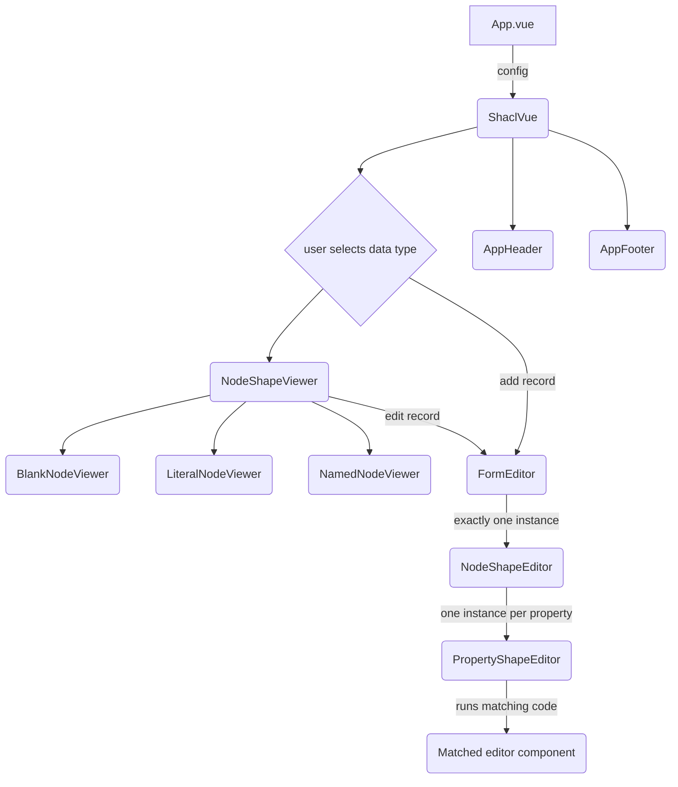

# Component Hierarchy

A VueJS application is made up of a hierarchy of components, with parent components instantiating any number or kind of child components based on defined logic and user interactions. The diagram below shows how `shacl-vue` is put together.

By default, a child component is instantiated by its parent using the appropriate component tag, which is based on the component filename, e.g. `<NodeShapeEditor></NodeShapeEditor>` for `NodeShapeEditor.vue`. The exception would be when dynamic programmatic component instantiation is used via the `component` tag and `:is` binding, e.g.:

`<component :is="myComponent"></component>`

This approach is used in `shacl-vue` for dynamically matching the appropriate editor component for a given `sh:PropertyShape`.

